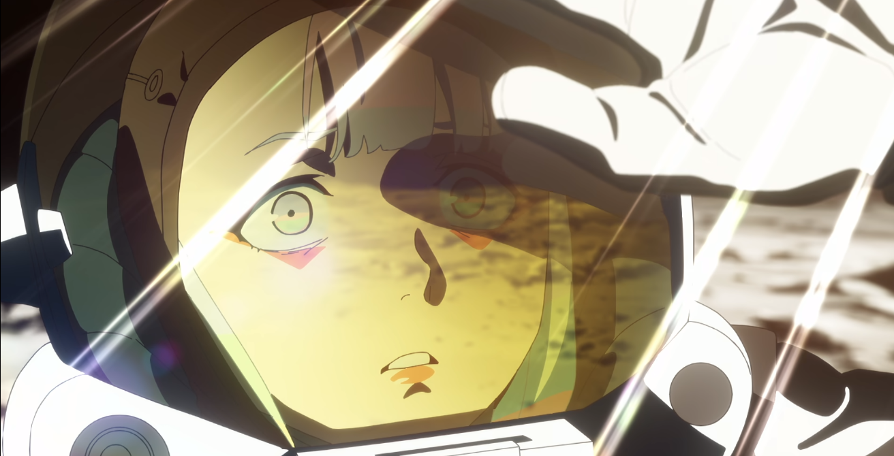

# Anime I watched recently

## \[To Watch] 

### Hunter x Hunter

### That Time I Got Reincarnated as a Slime | 關於我轉生變成史萊姆這檔事 | 転生したらスライムだった件

### Everyday | 日常 | 日常 

『にちじょう』

### Cowboy Bebop | 星際牛仔 | カウボーイビバップ

### Dr. Stone | Dr.STONE 新石紀&#x20;

## \[Watching]

### Frieren: Beyond Journey’s End | 葬送的芙莉蓮 | 葬送のフリーレン \[2023] 

『そうそうのフリーレン』

### The Quintessential Quintuplets | 五等分的新娘 | 五等分の花嫁 \[2019-2021]&#x20;

『ごとうぶんのはなよめ』

### One Piece | **海賊王 |** ワンピース \[95/100]

### Neon Genesis Evangelion | 新世紀福音戰士 | 新世紀エヴァンゲリオン \[1995] 

### Chobits | 人型電腦天使心 | ちょびっツ \[2002] \[ / ]

### Natsume's Book of Friends 夏目友人帳 | 夏目友人帳 \[2008-2017] \[/] 

『なつめ ゆうじんちょう』

### Bleach: Thousand-Year Blood War | BLEACH 千年血戰篇 | BLEACH 千年血戦篇 \[2022]

『せんねん けっせん へん』

### Darling in the Franxx | ダーリン・イン・ザ・フランキス \[2018]

## \[Watched]

### Cautious Hero: The Hero Is Overpowered but Overly Cautious | 這個勇者明明超TUEEE卻過度謹慎 | この勇者が俺TUEEEくせに慎重すぎる \[2019] \[86/100]

### Puella Magi Madoka Magica | 魔法少女小圓 | 魔法少女まどか☆マギカ \[92/100] 

### Record of Ragnarok | 終末的女武神 | 終末のワルキューレ Season1-2 \[88/100]

ワルキューレ Valkyrie

### Your Lie in April | 四月是你的謊言 | 四月は君の嘘 \[96/100]

『しがつはきみのうそ』

The music is beautiful. The feelings of anime characters are very touching.

The ending is sad, but 宮園薰（みやぞの かおり）'s life is a beautiful journey.

### Oshi no Ko | 我推的孩子 | 推しの子 Season1 \[2023] \[87/100]

### Komi Can't Communicate | 古見同學有交流障礙症 | 古見さんは、コミュ症です \[2021] \[78/100] 

『こみさんはコミュしょうです』

I only watched the first 10 episodes to study some Japanese.

The show is too childish and naive for me :(

### Cyberpunk: Edgerunners | 賽博朋克：邊緣行者 | サイバーパンク エッジランナーズ \[97/100]

A very beautiful and sad story. \
I have achieved my dream of getting to the moon, but I am left only in sadness because I can't be here with you.

<figure><figcaption></figcaption></figure>

<figure><figcaption></figcaption></figure>

### Chainsaw Man | 鏈鋸人 | チェンソーマン \[94/100] 

### Tokyo Ghoul | 東京喰種 | 東京喰種(Tōkyō Gūru) \[91/100]

### Ranking of Kings | 國王排名 | 王様ランキング \[93/100]

『おうさまランキング』

### Fire Force | 炎炎消防隊 | 炎炎ノ消防隊 Season 1 \[84/100]

『えんえんのしょうぼうたい』

### A Certain Magical Index | 魔法禁書目錄 | とある魔術の禁書目録 \[84/100] 

『とあるまじゅつのインデックス』

### The Seven Deadly Sins | 七つの大罪 Season 1 \[79/100]

### Spy × Family | 間諜過家家 | SPY×FAMILY \[94/100] 

### Ya Boy Kongming! | 派對咖孔明 | パリピ孔明 \[83/100] 

### Vampire in the Garden | 花園裡的吸血鬼 | ヴァンパイア・イン・ザ・ガーデン \[85/100] 

### Death Note | 死亡筆記本 | デスノート \[92/100]

### Demon Slayer: Kimetsu no Yaiba | 鬼滅之刃 | 鬼滅の刃 \[95/100]

〖きめつのやいば』

### JoJo's Bizarre Adventure | JoJo的奇妙冒險 | ジョジョの奇妙な冒険 \[93/100] 

### Jujutsu Kaisen | 咒術迴戰 | 呪術廻戦 \[95/100]

〖じゅじゅつ かいせん〗

### Attack on Titan | 進擊的巨人| 進撃の巨人 \[95/100]&#x20;

『しんげきのきょじん』

### Detective Conan | 名偵探柯南 | 名探偵コナン \[85/100]&#x20;

〖めいたんていコナン〗

### Sword Art Online | 刀劍神域 | ソードアート・オンライン Season 1 \[96/100]

### Code Geass | 反叛的魯路修 | コードギアス 反逆のルルーシュ \[96/100]

### My Hero Academia | 我的英雄學院 | 僕のヒーローアカデミア \[94/100]

Season 1-6&#x20;

### Re:Zero − Starting Life in Another World | Re：從零開始的異世界生活 Re:ゼロから始める異世界生活 | \[79/100]

### JAPAN SINKS: 2020 | 日本沈沒 2020 | 日本沈没2020 \[81/100] 

### Steins;Gate | 命運石之門 | Steins;Gate \[93/100] 

### OVERLORD | 不死者之王 | オーバーロード \[86/100] 

### Oruchuban Ebichu | 倉鼠管家 | おるちゅばんエビちゅ\[95/100]

### Anohana | 未聞花名 | あの花 \[99/100]

あの日見た花の名前を僕達はまだ知らない

### Gintama | 銀魂 | ぎんたま \[97/100]

### Naruto | 火影忍者 | NARUTO -ナルト- \[90/100]

### Dragon Ball | 七龍珠 | ドラゴンボール \[92/100] 

